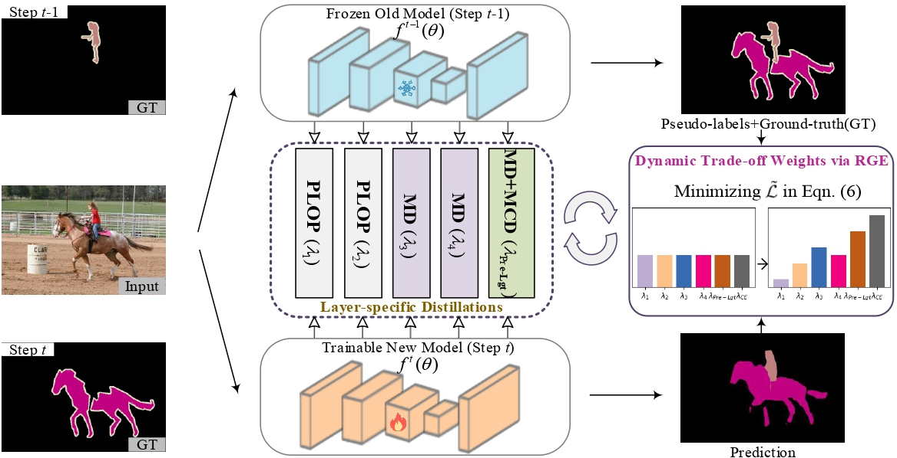

# Layer-Specific Knowledge Distillation for Class Incremental Semantic Segmentation

This repo is the official implementation of TIP jouneral "Layer-Specific Knowledge Distillation for Class Incremental Semantic Segmentation", created by  [Yiwen Wu](wwwyw@tju.edu.cn), [Qilong Wang](qlwang@tju.edu.cn).

## Introduction

In response to the challenge of catastrophic forgetting in class incremental semantic segmentation (CISS), we introduce Layer-Specific Knowledge Distillation (LSKD). LSKD dynamically tailors knowledge transfer schemes and weights to intermediate layers, enhancing CISS performance. Through Mask-Guided Distillation (MD) and Mask-Guided Context Distillation (MCD), LSKD mitigates background shifts and leverages global context information. Our approach outperforms existing methods on benchmarks like Pascal VOC 12 and ADE20K, establishing new state-of-the-art results.

  

