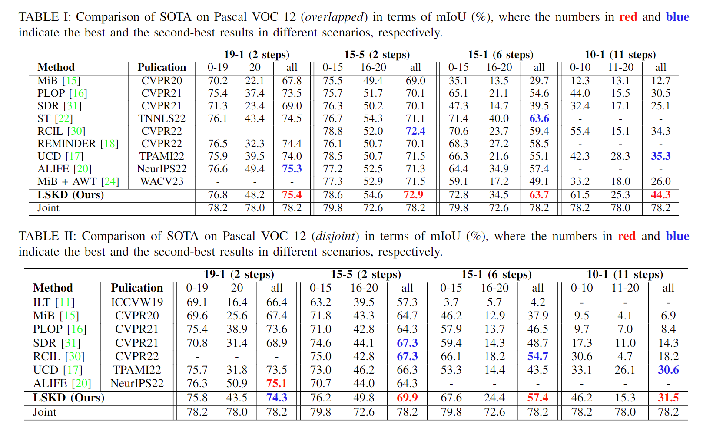

# Layer-Specific Knowledge Distillation for Class Incremental Semantic Segmentation

Welcome to the official repository for the TIP journal article "Layer-Specific Knowledge Distillation for Class Incremental Semantic Segmentation," authored by Yiwen Wu (wwwwyw@tju.edu.cn) and Qilong Wang (qlwang@tju.edu.cn).

## Introduction

Class Incremental Semantic Segmentation (CISS) poses significant challenges due to catastrophic forgetting. To address this, we present an innovative strategy named Layer-Specific Knowledge Distillation (LSKD). Our approach intelligently adapts knowledge transfer techniques and their significance across different layers to boost CISS performance. By employing Mask-Guided Distillation (MD) and Mask-Guided Context Distillation (MCD), LSKD effectively counters background shifts and capitalizes on global context, propelling our method ahead of existing solutions on renowned benchmarks such as Pascal VOC 12 and ADE20K, thereby achieving new state-of-the-art results.


## Getting Started

To replicate our environment and dive straight into utilizing LSKD, follow these simple steps:

### Environment Setup

Ensure you have Python installed on your system, then run the following command to install the required libraries:

```bash
pip install -r requirements.txt
```

## Reproducing Results

To facilitate the replication of our results, we provide a detailed script below. This script is designed to execute experiments sequentially for the 10-1 task configuration on the VOC dataset, leveraging distributed training across multiple GPUs. Please adjust the `CUDA_VISIBLE_DEVICES` environment variable to match your available GPU setup.

### Script for Experiments

Execute the following bash script to perform the experiments:

```bash
for e in $(seq 1 1 10)
do
  echo "Running step: $e"
  CUDA_VISIBLE_DEVICES=4,5,6,7 python3 -m torch.distributed.launch --master_port 8082 --nproc_per_node=4 /path/to/your/script/run2.py \
    --data_root /path/to/data \
    --batch_size 6 \
    --dataset voc \
    --name PLOP \
    --task 10-1 \
    --overlap \
    --step $e \
    --lr 0.001 \
    --epochs 20 \
    --method FT \
    --pod local \
    --pod_factor 0.01 \
    --pod_logits \
    --pseudo entropy \
    --threshold 0.001 \
    --classif_adaptive_factor \
    --init_balanced \
    --pod_options "{\"switch\": {\"after\": {\"extra_channels\": \"sum\", \"factor\": 0.0005, \"type\": \"local\"}}}" \
    --dis cos \
    --sigmoid whc \
    --aaaaaa 0.005 \
    --unkd \
    --loss_kd 10. \
    --mmm 20 \
    --adaptivealpha 10. \
    --adaptivebeta 0.0001 \
    --adaptivegamma 0.0005 \
    --opt_level O1
done
```

## Important Notes:
* Paths: Replace /path/to/your/script/run2.py and /path/to/data with the actual file paths to your script and dataset, respectively.
* Parameter Adjustments: You may need to adjust various parameters within the script according to your specific setup, hardware capabilities, and experimentation requirements.

## Experiment Results

